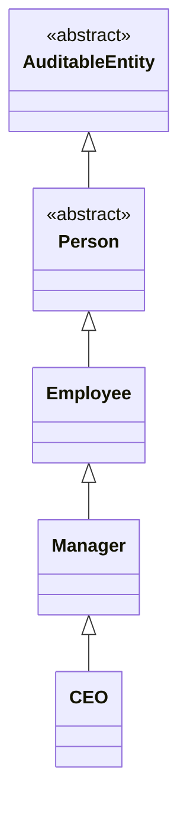

# Sample: Deep Inheritance & Generic Services

This sample demonstrates **Class Diagram** generation for complex, multi-level inheritance hierarchies and generic service architectures.
It showcases ProjGraph's expertise in resolving deep branch inheritance (5+ levels) and generic constraints.

## 🏙️ Domain: Corporate Structure

The sample models a typical corporate organizational chart with deep specialization:

- **Hierarchical Personnel**: `AuditableEntity` -> `Person` -> `Employee` -> `Manager` -> `CEO`.
- **Generic Infrastructure**: `IService<T>` and `IRepository<T>` patterns with specialized implementations.
- **Cross-Cutting Concerns**: Audit logging via Base classes and specialized Enums for Access Levels.

## 📊 Visual Snapshot

Below is the deep specialized hierarchy for the `CEO` class:



> [!TIP]
> This model is perfect for testing the `--depth` parameter. Try increasing it to see how many levels of parent classes ProjGraph can discover. View the latest snapshot in [complex-hierarchy.mmd](./complex-hierarchy.mmd).

## 🚀 Quick Start

To generate the full hierarchy for the `CEO` class including its 4 levels of ancestors, run:

```bash
projgraph classdiagram ./samples/classdiagram/complex-hierarchy/Domain/Models/CEO.cs --inheritance --dependencies --depth 5 --properties true --functions true > ./samples/classdiagram/complex-hierarchy/complex-hierarchy.mmd
```

### Parameters explained

- `--depth 5`: Ensures all 5 levels of inheritance from `CEO` back to `AuditableEntity` are captured.
- `--inheritance`: Explicitly enables parent-class discovery across the project.

## 🛠️ Build and Test

This project tests deep-tree resolution. Build it using:

```bash
dotnet build ./samples/classdiagram/complex-hierarchy/
```

### Analyze the hierarchy

```bash
# Analyze the CEO hierarchy (5 levels)
projgraph classdiagram ./samples/classdiagram/complex-hierarchy/Domain/Models/CEO.cs --depth 5

# Analyze the Service layer with generics
projgraph classdiagram ./samples/classdiagram/complex-hierarchy/Services/EmployeeService.cs
```

## Key Features Demonstrated

### 1. **Deep Ancestry Resolution**

The tool follows the inheritance chain even through multiple files and namespaces.

### 2. **Generic Interface Implementation**

Visualizes how `EmployeeService` implements `IRepository<Employee>`.

### 3. **Abstract vs Concrete Types**

Distinguishes between abstract base classes and concrete implementations using `<<abstract>>`.

## Running the Sample

1. Navigate to the sample directory:

   ```bash
   cd samples/classdiagram/complex-hierarchy
   ```

2. Run the class diagram tool:

   ```bash
   projgraph classdiagram Domain/Models/CEO.cs --depth 5
   ```
