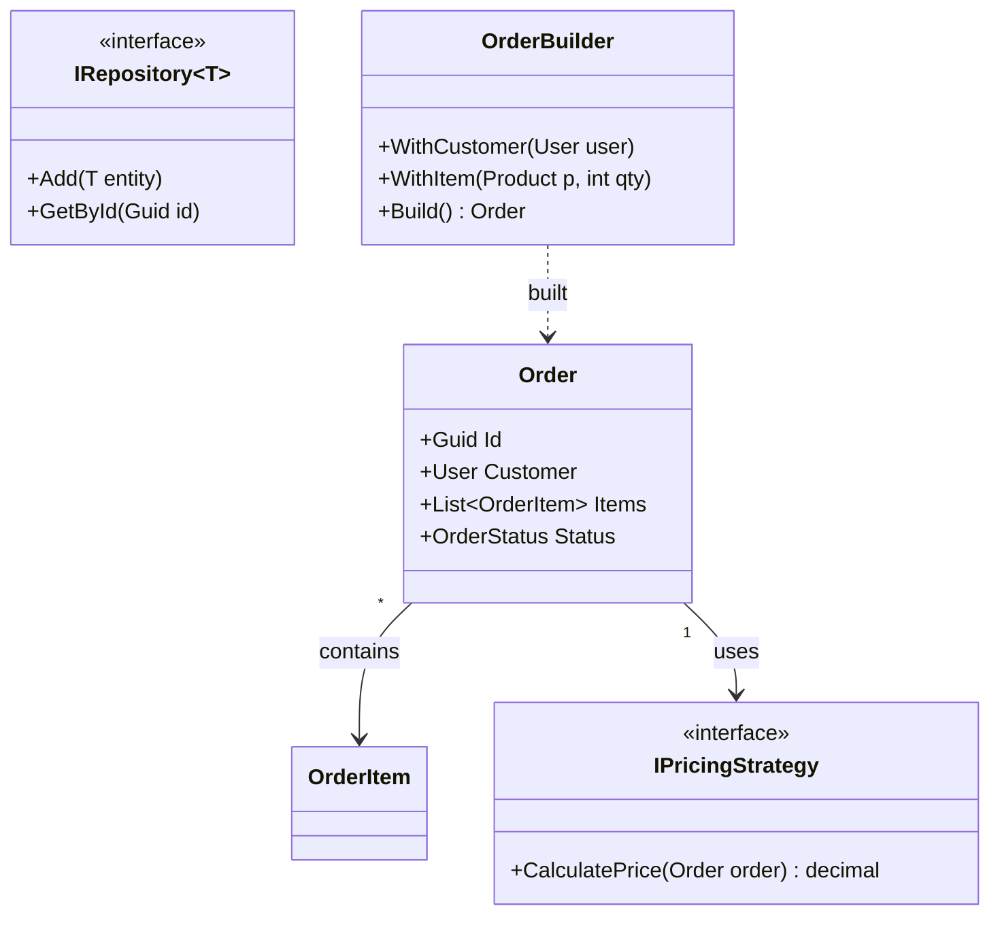

# Sample: Design Patterns & Advanced OOP

This sample is a comprehensive showcase of **Class Diagram** generation for sophisticated C# architectures.
It demonstrates ProjGraph's support for design patterns, generic constraints, multi-level inheritance, and complex associations.

## 🏙️ Domain: Enterprise Order System

The sample implements several industry-standard design patterns:

- **Creational**: `OrderBuilder` (Fluent Builder), Generic Repository, and Unit of Work.
- **Structural**: `LoggingNotificationService` (Decorator), `CompositeValidator` (Composite).
- **Behavioral**: `IPricingStrategy` (Strategy), `IDomainEvent` (Observer), and `ICommand` (Command).

## 📊 Visual Snapshot

Below is a high-level view of the `Order` aggregate and its related patterns:



> [!TIP]
> Use the `--depth` and `--dependencies` flags to explore this complex web of relationships. View the latest snapshot in [design-patterns.mmd](./design-patterns.mmd).

## 🚀 Quick Start

To generate a detailed diagram of the `Order` class including its dependencies and inheritance, run:

```bash
projgraph classdiagram ./samples/classdiagram/design-patterns/Domain/Order.cs --inheritance --dependencies --depth 2 --properties true --functions true > ./samples/classdiagram/design-patterns/design-patterns.mmd
```

### Parameters explained

- `--inheritance`: Shows the full hierarchy of `Order` (e.g., `AuditableEntity` -> `Entity`).
- `--dependencies`: Discovers related types like `User`, `OrderItem`, and `IPricingStrategy`.
- `--properties true`: Includes fields and properties in the diagram nodes.

## 🛠️ Build and Test

This is a multi-file enterprise-grade sample. Build it using:

```bash
dotnet build ./samples/classdiagram/design-patterns/
```

### Analyze Specific Patterns

Run these from the repository root to see ProjGraph in action:

```bash
# Analyze the entire service layer
projgraph classdiagram ./samples/classdiagram/design-patterns/Services/OrderService.cs

# View the repository pattern implementation
projgraph classdiagram ./samples/classdiagram/design-patterns/Repositories/Repository.cs

# Strategy pattern visualization
projgraph classdiagram ./samples/classdiagram/design-patterns/Interfaces/IPaymentStrategy.cs

# Builder pattern
projgraph classdiagram ./samples/classdiagram/design-patterns/Builders/OrderBuilder.cs

# Repository pattern with generic constraints
projgraph classdiagram ./samples/classdiagram/design-patterns/Repositories/UserRepository.cs
```

### Discovery Options

```bash
# Deep discovery (show all relationships up to depth 5)
projgraph classdiagram ./samples/classdiagram/design-patterns/Domain/Order.cs --depth 5

# Include only direct dependencies
projgraph classdiagram ./samples/classdiagram/design-patterns/Services/OrderService.cs --depth 1
```

## Key Features Demonstrated

### 1. **Complex Inheritance Chains**

```raw
IEntity → Entity → AuditableEntity → User/Product/Order
```

### 2. **Generic Constraints**

```csharp
IRepository<T> where T : class, IEntity
Repository<T> : IRepository<T> where T : Entity
```

### 3. **Multiple Interfaces**

```csharp
OrderService : IOrderService, INotificationService
```

### 4. **Composition & Aggregation**

- Order **composes** OrderItems (strong ownership)
- ShoppingCart **aggregates** Products (weak reference)

### 5. **Strategy Pattern**

- Interchangeable payment methods
- Different pricing strategies

### 6. **Builder Pattern**

- Fluent API for complex object creation

## Expected Output

The tool will generate a comprehensive Mermaid diagram showing:

- ✅ Multiple inheritance levels
- ✅ Generic type parameters with constraints
- ✅ Interface implementations
- ✅ Composition relationships (filled diamonds)
- ✅ Association relationships (lines)
- ✅ Dependency relationships (dashed lines)
- ✅ Cardinality markers (1, *, 0..1)
- ✅ Abstract classes marked with `<<abstract>>`
- ✅ Interface markers with `<<interface>>`
- ✅ Enum types with `<<enumeration>>`

## Running the Sample

1. Navigate to the sample directory:

   ```bash
   cd samples\classdiagram\design-patterns
   ```

2. Run the class diagram tool:

   ```bash
   projgraph classdiagram Domain/Order.cs
   ```

3. The output will be a complete Mermaid class diagram showing the entire domain model with all relationships.

## Learning Outcomes

This sample demonstrates:

- ✅ How to model complex business domains
- ✅ Proper application of design patterns
- ✅ Clean architecture principles
- ✅ SOLID principles in action
- ✅ Advanced C# features (generics, constraints, etc.)
- ✅ How the class diagram tool handles real-world complexity
