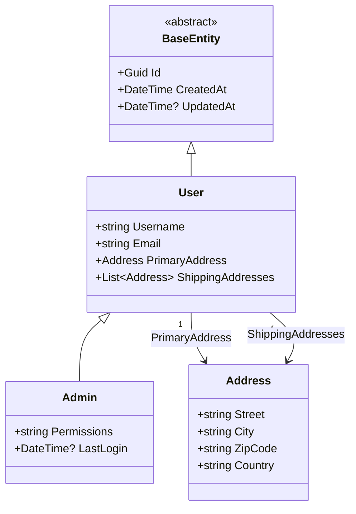

# Simple Class Hierarchy Example

A C# sample project demonstrating inheritance, composition, and dependencies for the **Class Diagram** feature.

## Model Structure

This example includes:

- **BaseEntity**: Abstract base class with `Id`, `CreatedAt`, and `UpdatedAt`.
- **User**: Inherits from `BaseEntity`. Contains an `Address` and a list of `Address` objects.
- **Admin**: Inherits from `User`. Adds `Permissions` and `LastLogin`.
- **Address**: A plain data model used by `User`.
- **IRepository<T>**: A generic interface for repository operations.

## Usage

### Direct File Analysis

```bash
# Analyze a specific file
projgraph classdiagram Models/User.cs

# Analyze a class and its hierarchy with discovery
projgraph classdiagram Models/Admin.cs
```

### Discovery Logic

When you run `classdiagram` on a file, the tool will:

1. Parse the specified file for class definitions.
2. If base classes or typed properties (dependencies) are found but not defined in the same file, it searches the
   workspace root (detecting `.sln`, `.csproj`, or `.git` folders) to find the missing definitions.
3. It recursively builds the diagram up to a default depth (or as specified).

## Output

The tool generates a **Mermaid Class Diagram** showing:

- Class names and their members (properties/fields).
- Inheritance relationships (`<|--`).
- Association relationships (`-->`).
- Dependency relationships (`..>`).
- Support for generics (e.g., `List~Address~`).
- Cardinality labels (e.g., `"1"`, `"*"`).
- Property names on relationships.

### Example Output for Admin


