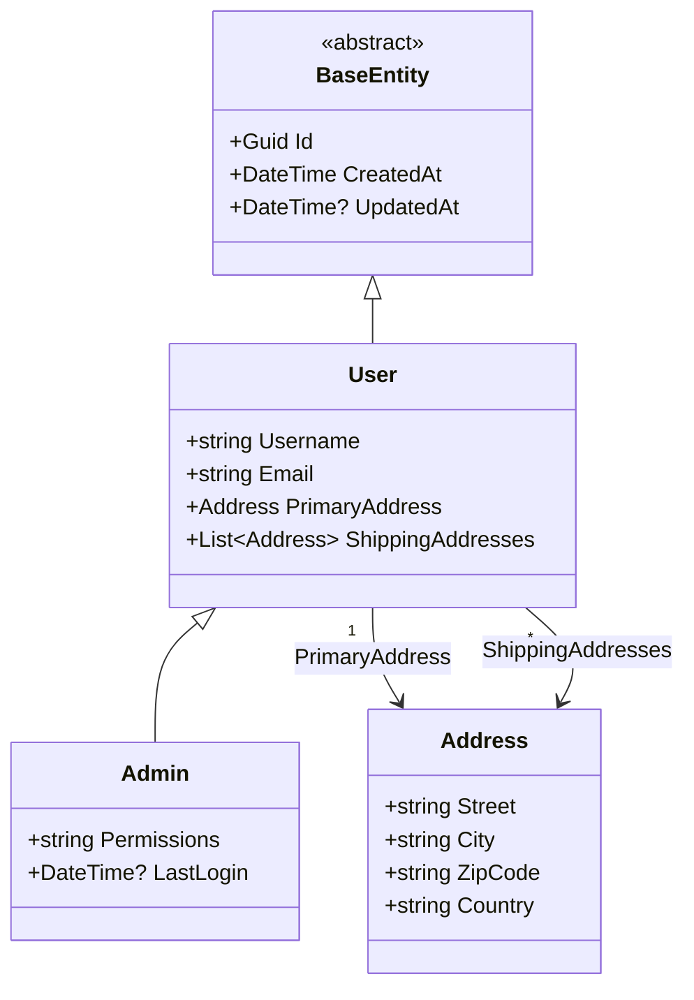

# Sample: Simple Class Hierarchy

This sample demonstrates **Class Diagram** generation for a basic object-oriented hierarchy in C#.
It showcases inheritance, interface implementation, and property associations (composition).

## 🏙️ Domain: User Management

The domain consists of a simple user and administration model:

- `BaseEntity`: An abstract base class providing common metadata (`Id`, `CreatedAt`).
- `User`: A domain model representing a registered person.
- `Admin`: A specialized user with elevated permissions.
- `Address`: A value object used to describe physical locations.
- `IRepository`: A generic interface for data access.

## 📊 Visual Snapshot

Below is the diagram generated for the `Admin` class using ProjGraph:



> [!TIP]
> This diagram was generated directly from the source code. You can find the latest snapshot in [simple-hierarchy.mmd](./simple-hierarchy.mmd).

## 🚀 Quick Start

To generate this diagram yourself, run the following command from the repository root:

```bash
projgraph classdiagram ./samples/classdiagram/simple-hierarchy/Models/Admin.cs --inheritance --dependencies --depth 2 --properties true --functions true > ./samples/classdiagram/simple-hierarchy/simple-hierarchy.mmd
```

### Parameters explained

- `--inheritance`: Automatically discovers and includes base classes (`User`, `BaseEntity`).
- `--dependencies`: Discovers related types used as properties (`Address`).
- `--depth 2`: Traverses relationships up to two levels deep.

## 🛠️ Build and Test

This project is a standard .NET 10 library. You can build it using:

```bash
dotnet build ./samples/classdiagram/simple-hierarchy/
```
