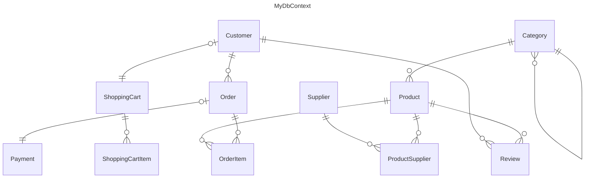

# Sample: Complex E-commerce ERD

This sample demonstrates advanced **Entity Relationship Diagram (ERD)** generation for a real-world e-commerce schema.
It showcases ProjGraph's ability to handle complex Entity Framework Core features like deep inheritance, recursive relationships, and many-to-many associations.

## 🏙️ Domain: E-commerce Platform

The domain is a comprehensive e-commerce system:

- **Product Hierarchy**: Using Table-Per-Hierarchy (TPH) to model `DigitalProduct` and `PhysicalProduct`.
- **Hierarchical Categories**: Self-referencing records allowing nested categories (e.g., Electronics -> Audio -> Headphones).
- **Core Operations**: Customers, Orders, OrderItems, and Payments.
- **Support Systems**: Shopping Carts, Product Reviews, and Multi-Supplier mapping.

## 📊 Visual Snapshot

Below is the diagram generated for this complex model:



*(Note: Fields and detailed property mappings are omitted from this README preview for clarity. View the [full snapshot](./complex-ecommerce.mmd) for the complete diagram.)*

## ✨ Key EF Core Features Shown

- **TPH Inheritance**: `DigitalProduct` and `PhysicalProduct` inherit from `Product`.
- **Many-to-Many**: `Product` and `Supplier` via the `ProductSupplier` join table.
- **Recursive Relationships**: `Category.ParentCategory` FK.
- **One-to-One**: `Customer.ShoppingCart`.
- **Value Objects**: Shared `Money` type used for Prices and Payments.

## 🚀 Quick Start

To generate this diagram yourself, run the following command from the repository root:

```bash
projgraph erd ./samples/erd/complex-ecommerce/Data/MyDbContext.cs > ./samples/erd/complex-ecommerce/complex-ecommerce.mmd
```

## 🛠️ Build and Test

This project illustrates a non-trivial data model. Build it with:

```bash
dotnet build ./samples/erd/complex-ecommerce/
```
