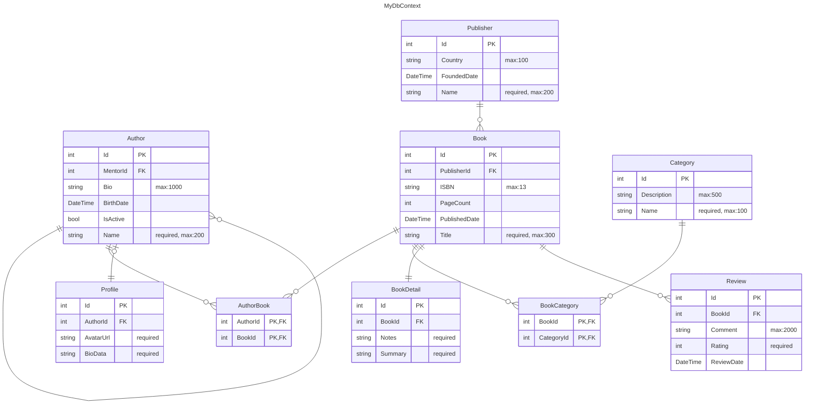

# Sample: Simple DbContext ERD

This sample demonstrates **Entity Relationship Diagram (ERD)** generation for a standard Entity Framework Core `DbContext`.
It showcases how ProjGraph visualizes database schemas including one-to-many, many-to-many, and one-to-one relationships.

## 🏙️ Domain: Library Management

The domain consists of a simple book management schema:

- **Authors & Books**: A many-to-many relationship (`AuthorBook` join table).
- **Books & Categories**: A many-to-many relationship (`BookCategory` join table).
- **Publishers**: A one-to-many relationship with Books.
- **Reviews**: A one-to-many relationship for each Book.
- **Profiles & BookDetails**: One-to-one relationships providing additional metadata.

## 📊 Visual Snapshot

Below is the diagram generated for the `MyDbContext` class using ProjGraph:


> [!TIP]
> This diagram was generated directly from the `DbContext` source. You can find the latest snapshot in [simple-context.mmd](./simple-context.mmd).

## 🚀 Quick Start

To generate this diagram yourself, run the following command from the repository root:

```bash
projgraph erd ./samples/erd/simple-context/EntityFramework/MyDbContext.cs > ./samples/erd/simple-context/simple-context.mmd
```

## 🛠️ Build and Test

This project is a standard .NET 10 project using EF Core. You can build it using:

```bash
dotnet build ./samples/erd/simple-context/
```

### Example Output



### Rendered Diagram

The Mermaid diagram renders as a visual ERD showing:

- Entity boxes with all properties and their types
- Relationship lines with cardinality indicators:
  - `||--o{` = One-to-Many (required)
  - `|o--o{` = One-to-Many (optional)
  - `||--||` = One-to-One (required)
  - `||--o|` = One-to-One (optional)
  - `}|--|{` = Many-to-Many (shown as two One-to-Many via join table)

## Key Features

### ✅ Direct DbContext File Analysis

- **DbContext files** (`.cs`) - Direct analysis of DbContext classes
- **Auto-detection** - Finds `*DbContext.cs` files in current directory
- **No build required** - Works with source code directly
- **Inheritance support** - Includes properties from base classes (e.g., `AuditEntity`, `BaseEntity`)

### ✅ Comprehensive Type Information

- **Sanitized types** for Mermaid compatibility (removes `?`, `<>`, `[]`)
- **Original type comments** showing exact C# types including nullability
- **Validation constraints** extracted from data annotations and Fluent API:
  - `required` - Fields marked as required (non-nullable or `[Required]`)
  - `max:N` - Maximum length constraints from `[MaxLength]` or `HasMaxLength()`
  - `precision(P,S)` - Decimal precision and scale from `[Column]` or `HasPrecision()`
  - `default:value` - Default values from `HasDefaultValue()`
- **Example**: `string Name "string? | required, max:200"` shows original type, required status, and max length

### ✅ Explicit Join Tables

- **Many-to-many relationships** are shown as explicit join tables
- Join tables include composite primary/foreign keys
- Clear visualization of the actual database structure
- **Example**: `AuthorBook` table with `AuthorId` and `BookId` columns

### ✅ Proper Relationship Detection

- **One-to-Many**: Correctly identifies parent-child relationships
- **One-to-One**: Detects bidirectional single references
- **Many-to-Many**: Discovers collection navigations on both sides
- **Inverse navigation analysis**: Determines relationship direction from code

### ✅ Clean Output

- No duplicate properties or relationships
- Valid Mermaid syntax (comma-separated PK,FK markers)
- Consistent label formatting for all relationships
- Entity names and labels properly trimmed

## Advanced Usage

### Save to File

```bash
# Save the ERD diagram to a file
projgraph erd EntityFramework/MyDbContext.cs > erd-diagram.mmd

# Or save to markdown for documentation
projgraph erd EntityFramework/MyDbContext.cs > docs/database-schema.md
```

### Integration with Documentation

The output is **GitHub/GitLab compatible** Mermaid syntax, so you can:

1. Copy the output directly into your `README.md`
2. Commit it to version control
3. It will render automatically in GitHub, GitLab, and other platforms
