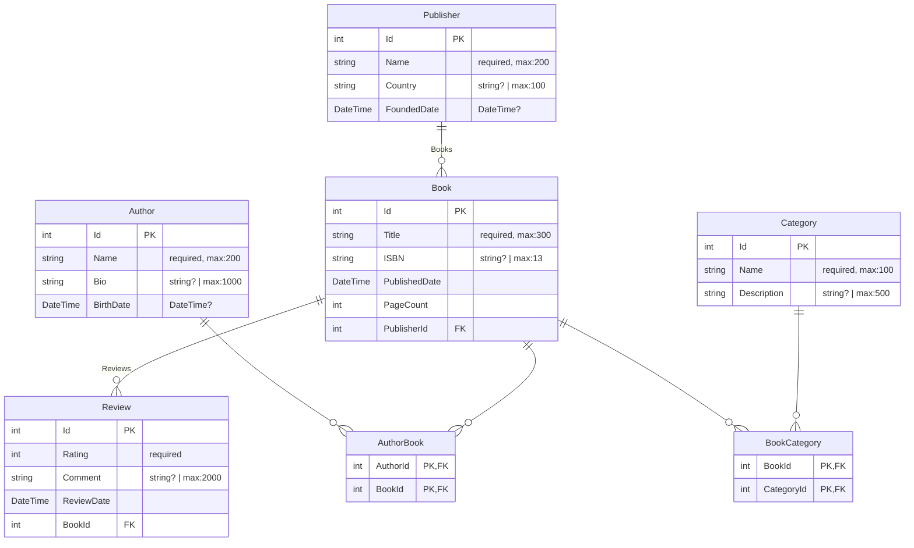

# Simple DbContext ERD Example

Entity Framework Core DbContext with a simple book management schema demonstrating **one-to-many** and **many-to-many**
relationships.

## Database Schema

This example includes:

- **5 entities**: Author, Book, Category, Publisher, Review
- **2 many-to-many relationships**: Book ↔ Author, Book ↔ Category
- **2 one-to-many relationships**: Publisher → Book, Book → Review

## Usage

### Direct DbContext File

```bash
# Specify the DbContext .cs file directly
projgraph erd EntityFramework/MyDbContext.cs

# Or let it auto-detect in current directory
cd EntityFramework
projgraph erd

# Specify a particular DbContext if multiple exist in the file
projgraph erd EntityFramework/MyDbContext.cs --context MyDbContext
```

## Output

The tool generates a **Mermaid ERD diagram** showing:

- All entities with their properties
- Property types (with original C# type in comments for nullable types, generics, etc.)
- Primary keys (PK) and foreign keys (FK)
- **Explicit join tables** for many-to-many relationships
- Relationship cardinalities with proper notation

### Example Output



### Rendered Diagram

The Mermaid diagram renders as a visual ERD showing:

- Entity boxes with all properties and their types
- Relationship lines with cardinality indicators:
  - `||--o{` = One-to-Many (required)
  - `|o--o{` = One-to-Many (optional)
  - `||--||` = One-to-One (required)
  - `}|--|{` = Many-to-Many (shown as two One-to-Many via join table)

## Key Features

### ✅ Direct DbContext File Analysis

- **DbContext files** (`.cs`) - Direct analysis of DbContext classes
- **Auto-detection** - Finds `*DbContext.cs` files in current directory
- **No build required** - Works with source code directly

### ✅ Comprehensive Type Information

- **Sanitized types** for Mermaid compatibility (removes `?`, `<>`, `[]`)
- **Original type comments** showing exact C# types including nullability
- **Validation constraints** extracted from data annotations and Fluent API:
  - `required` - Fields marked as required (non-nullable or `[Required]`)
  - `max:N` - Maximum length constraints from `[MaxLength]` or `HasMaxLength()`
  - `precision(P,S)` - Decimal precision and scale from `[Column]` or `HasPrecision()`
  - `default:value` - Default values from `HasDefaultValue()`
- **Example**: `string Name "string? | required, max:200"` shows original type, required status, and max length

### ✅ Explicit Join Tables

- **Many-to-many relationships** are shown as explicit join tables
- Join tables include composite primary/foreign keys
- Clear visualization of the actual database structure
- **Example**: `AuthorBook` table with `AuthorId` and `BookId` columns

### ✅ Proper Relationship Detection

- **One-to-Many**: Correctly identifies parent-child relationships
- **One-to-One**: Detects bidirectional single references
- **Many-to-Many**: Discovers collection navigations on both sides
- **Inverse navigation analysis**: Determines relationship direction from code

### ✅ Clean Output

- No duplicate properties or relationships
- Valid Mermaid syntax (comma-separated PK,FK markers)
- Consistent label formatting for all relationships
- Entity names and labels properly trimmed

## Advanced Usage

### Save to File

```bash
# Save the ERD diagram to a file
projgraph erd EntityFramework/MyDbContext.cs > erd-diagram.mmd

# Or save to markdown for documentation
projgraph erd EntityFramework/MyDbContext.cs > docs/database-schema.md
```

### Integration with Documentation

The output is **GitHub/GitLab compatible** Mermaid syntax, so you can:

1. Copy the output directly into your `README.md`
2. Commit it to version control
3. It will render automatically in GitHub, GitLab, and other platforms

## Example Workflow

```bash
# 1. Generate ERD from your DbContext
projgraph erd MyProject/Data/ApplicationDbContext.cs > docs/database-erd.md

# 2. Commit to repository
git add docs/database-erd.md
git commit -m "docs: Add database ERD diagram"

# 3. Push - diagram will render automatically on GitHub!
git push
```

## Tips

💡 **Nullable Types**: Original C# types (including `?` for nullable) are preserved in comments

💡 **Join Tables**: Many-to-many relationships create explicit join table entities for clarity

💡 **Complex Schemas**: Works with large DbContexts containing dozens of entities

💡 **Entity Framework Core**: Supports EF Core 6.0+ including fluent API configurations

💡 **Documentation**: Perfect for maintaining up-to-date database schema documentation
