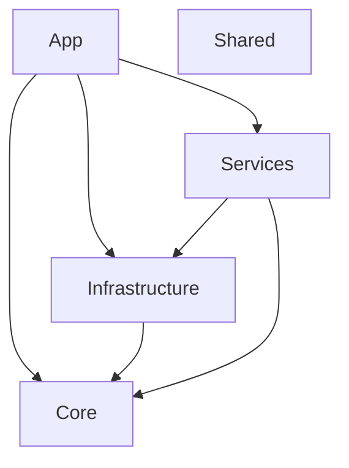

# Sample: Modular Architecture (SLNX)

This sample demonstrates **Project Dependency Visualization** for a modern, multi-project solution architecture.
It showcases ProjGraph's native support for the new XML-based `.slnx` solution format introduced in Visual Studio 2022.

## 🏙️ Architecture: Layered Modular Design

The solution follows a standard layered architecture with five distinct projects:

- **App**: The entry point (CLI or Web). Depends on all other layers.
- **Services**: Orchestration layer. Depends on `Infrastructure` and `Core`.
- **Infrastructure**: Implementation of persistence and external services. Depends on `Core`.
- **Core**: The domain layer (Models & Abstractions). Has no dependencies.
- **Shared**: A leaf utilities project with common extensions.

## 📊 Visual Snapshot

Below is the dependency graph generated for the solution:



> [!TIP]
> This diagram was generated directly from the `.slnx` solution file. You can find the latest snapshot in [modular-architecture.mmd](./modular-architecture.mmd).

## 🚀 Quick Start

To generate this diagram yourself, run the following command from the repository root:

```bash
projgraph visualize ./samples/visualize/modular-architecture/ModularArchitecture.slnx --format mermaid > ./samples/visualize/modular-architecture/modular-architecture.mmd
```

### Alternative: ASCII Tree

For a quick hierarchical view in your terminal:

```bash
projgraph visualize ./samples/visualize/modular-architecture/ModularArchitecture.slnx
```

## 🛠️ Build and Test

This solution uses modern .NET project settings. Build it with:

```bash
dotnet build ./samples/visualize/modular-architecture/ModularArchitecture.slnx
```
