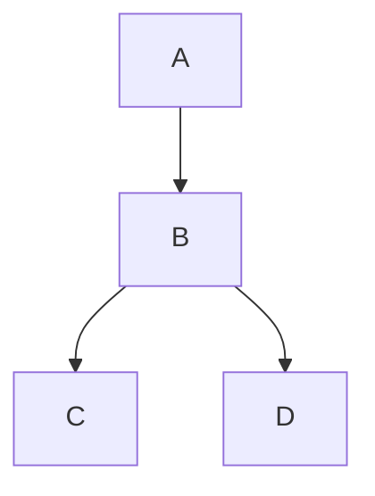

# Simple Dependencies Example

Four projects demonstrating basic dependency structure: **A** → **B** → **C**, **D**

## Usage

### Tree Format (Default)

```bash
projgraph visualize simple-dependencies.slnx
# or from a single project (recursively discovers all dependencies)
projgraph visualize A/A.csproj
```

**Output:**

```bash
Projects
├── 📦 A
│   └── → B
├── 📦 B
│   ├── → C
│   └── → D
├── 📦 C
└── 📦 D
```

### Mermaid Format

```bash
projgraph visualize simple-dependencies.slnx --format mermaid > dependencies.mmd
# or
projgraph visualize A/A.csproj --format mermaid
```

**Output:**



## Key Features

- **Supports `.sln`, `.slnx`, or `.csproj` files** - Start from any entry point
- **Recursive discovery** - When starting from `.csproj`, automatically finds all referenced projects
- **Tree format** - Quick terminal viewing
- **Mermaid format** - Documentation-ready diagrams
- **Circular dependency detection** - Automatically highlighted in output
