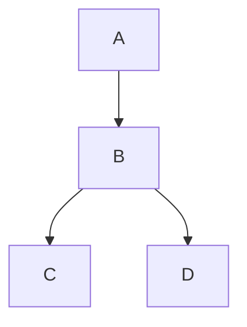

# Sample: Simple Project Dependencies

This sample demonstrates **Project Dependency Visualization** for a modern .NET solution using the `.slnx` format.
It showcases how ProjGraph renders project-to-project references as both ASCII trees and Mermaid diagrams.

## 🏙️ Architecture: Diamond Dependency

The sample solution consists of four projects with a clear dependency flow:

- **Project A**: The entry point/application project.
- **Project B**: A shared library used by A.
- **Project C & D**: Low-level infrastructure or utility projects used by B.

Structure: `A` → `B` → (`C`, `D`)

## 📊 Visual Snapshot

Below is the dependency graph generated for the solution using ProjGraph:



> [!TIP]
> This diagram was generated directly from the `.slnx` solution file. You can find the latest snapshot in [simple-dependencies.mmd](./simple-dependencies.mmd).

## 🚀 Quick Start

To generate this diagram yourself, run the following command from the repository root:

```bash
projgraph visualize ./samples/visualize/simple-dependencies/simple-dependencies.slnx --format mermaid > ./samples/visualize/simple-dependencies/simple-dependencies.mmd
```

### Alternative: ASCII Tree

For a quick view in your terminal, run:

```bash
projgraph visualize ./samples/visualize/simple-dependencies/simple-dependencies.slnx
```

## 🛠️ Build and Test

The solution contains multiple projects. You can build all of them using:

```bash
dotnet build ./samples/visualize/simple-dependencies/simple-dependencies.slnx
```
