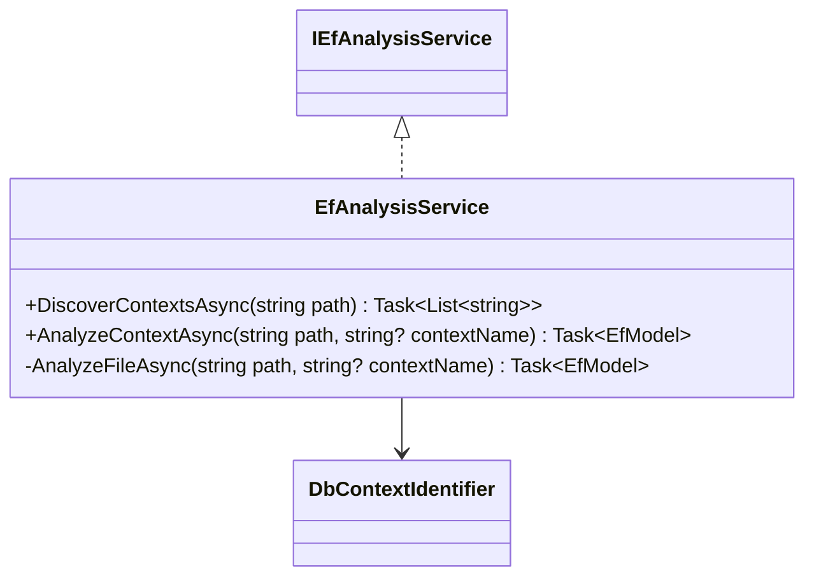

# Quickstart: Mermaid Class Diagram

## CLI Usage

Generate a class diagram for a specific file:

```bash
projgraph class-diagram ./src/MyProject/MyClass.cs
```

Include inheritance and dependencies found in the workspace:

```bash
projgraph class-diagram ./src/MyProject/MyClass.cs --inheritance --dependencies --depth 2
```

Save to a file:

```bash
projgraph class-diagram ./src/MyProject/MyClass.cs --output diagram.mmd
```

## MCP Usage (via LLM)

"Can you show me the class diagram for `D:\ProjGraph\src\ProjGraph.Lib\Services\EfAnalysis\EfAnalysisService.cs` including its base classes?"

The LLM will call `get_class_diagram(filePath: "...", includeInheritance: true)`.

## Example Output


