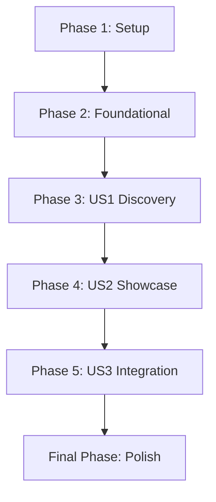

# Tasks: Showcase Samples & Reference Documentation

**Input**: Design documents from `/specs/005-improve-samples/`
**Prerequisites**: [plan.md](plan.md), [spec.md](spec.md), [research.md](research.md), [data-model.md](data-model.md), [contracts/sample-commands.md](contracts/sample-commands.md)

**Organization**: Tasks are grouped by user story to enable independent implementation and testing of each story.

## Format: `[ID] [P?] [Story] Description`

- **[P]**: Can run in parallel (different files, no dependencies)
- **[Story]**: Which user story this task belongs to (e.g., US1, US2, US3)
- Include exact file paths in descriptions

## Phase 1: Setup (Shared Infrastructure)

**Purpose**: Project initialization and basic structure

- [X] T001 Standardize `samples/Directory.Build.props` to target net10.0 and enforce global build settings
- [X] T002 Create root `samples/README.md` as a "Map of ProjGraph Capabilities"
- [X] T003 Clean all existing sample directories of `bin/` and `obj/` legacy folders
- [X] T004 [P] Update root `.gitignore` to ensure `bin/` and `obj/` are excluded for all samples

---

## Phase 2: Foundational (Blocking Prerequisites)

**Purpose**: Core infrastructure for documentation maintenance

- [X] T005 Create internal `scripts/regenerate-samples.ps1` template that runs `projgraph` commands and saves to snapshots

**Goal**: Transform existing basic samples into clear, self-documented entry points.

**Independent Test**: Navigate to a sample directory (e.g., `samples/classdiagram/simple-hierarchy/`), read the `README.md`, and run the exact command to see a valid Mermaid snapshot.

### Implementation for User Story 1

- [X] T007 [P] [US1] Create standardized `README.md` for `samples/classdiagram/simple-hierarchy/` with Quick Start
- [X] T008 [P] [US1] Generate and verify `samples/classdiagram/simple-hierarchy/snapshots/simple-hierarchy.mmd`
- [X] T009 [P] [US1] Create standardized `README.md` for `samples/erd/simple-context/` with Quick Start
- [X] T010 [P] [US1] Generate and verify `samples/erd/simple-context/snapshots/erd.mmd`
- [X] T011 [P] [US1] Create standardized `README.md` for `samples/visualize/simple-dependencies/` with Quick Start
- [X] T012 [P] [US1] Generate and verify `samples/visualize/simple-dependencies/snapshots/dependencies.mmd`

**Checkpoint**: Basic discovery flow is functional for new users.

---

## Phase 4: User Story 2 - Real-World Performance Validation (Priority: P2)

**Goal**: Create high-impact, complex samples that demonstrate ProjGraph's power and scale.

**Independent Test**: Build and render the `complex-ecommerce` ERD. It should contain 12+ entities with inheritance and recursive relationships without rendering errors.

### Implementation for User Story 2

- [X] T013 [US2] Implement `samples/erd/complex-ecommerce/` project with the 12+ entities from `data-model.md`
- [X] T014 [US2] Create standardized `README.md` for `samples/erd/complex-ecommerce/`
- [X] T015 [US2] Generate `samples/erd/complex-ecommerce/snapshots/erd.mmd` using `projgraph erd`
- [X] T016 [US2] Enhance `samples/classdiagram/design-patterns/` source code to fully implement patterns from `data-model.md`
- [X] T017 [US2] Create standardized `README.md` for `samples/classdiagram/design-patterns/`
- [X] T018 [US2] Generate `samples/classdiagram/design-patterns/snapshots/design-patterns.mmd` using `projgraph classdiagram`
- [X] T019 [P] [US2] Update `samples/classdiagram/complex-hierarchy/` with deep nesting (3+ levels)
- [X] T020 [P] [US2] Create standardized `README.md` for `samples/classdiagram/complex-hierarchy/`
- [X] T021 [P] [US2] Generate `samples/classdiagram/complex-hierarchy/snapshots/complex-hierarchy.mmd`
- [X] T022 [US2] Implement `samples/visualize/modular-architecture/` using a `.slnx` file and 5+ projects
- [X] T023 [US2] Create standardized `README.md` for `samples/visualize/modular-architecture/`
- [X] T024 [US2] Generate `samples/visualize/modular-architecture/snapshots/dependencies.mmd`

**Checkpoint**: Showcase samples provide "Impactful" visual examples.

---

## Phase 5: User Story 3 - CI/CD Integration Reference (Priority: P3)

**Goal**: Ensure snapshots and samples are reliable, buildable, and automated.

**Independent Test**: Running `scripts/regenerate-samples.ps1` completes successfully for all samples without manual intervention.

### Implementation for User Story 3

- [X] T025 [P] [US3] Finalize `scripts/regenerate-samples.ps1` (with timing logic for SC-001) to automate all snapshot generation defined in `contracts/sample-commands.md`
- [X] T026 [US3] Verify that `dotnet build samples/` succeeds for the entire directory (no warnings/errors)
- [X] T027 [P] [US3] Convert legacy `.sln` samples to `.slnx` format where multi-project solutions exist
- [X] T031 [US3] Document edge cases (Missing Solution Files, Tool Versioning) in `quickstart.md` or root samples README

---

## Final Phase: Polish & Cross-Cutting Concerns

**Purpose**: Consistency check and final documentation review

- [X] T028 [P] Review all sample `README.md` files for professional domain-appropriate naming (No "Foo", "Bar")
- [X] T029 [P] Embed all Mermaid code snippets directly into `README.md` for native GitHub rendering (per `research.md`)
- [X] T030 Final verification of all links in root `samples/README.md`

## Dependency Graph

## Parallel Execution Examples

### Parallel Track A: Class Diagram Samples

- T007 [P] [US1] ClassDiagram Simple README
- T016 [US2] Design Patterns implementation
- T019 [P] [US2] Complex Hierarchy nesting

### Parallel Track B: ERD Samples

- T009 [P] [US1] ERD Simple README
- T013 [US2] Complex Ecommerce implementation

### Execution Strategy

1. **MVP**: Complete Phase 1, Phase 2, and Phase 3 (US1). This provides immediate value by fixing existing broken links/samples.
2. **Expansion**: Complete Phase 4 (US2) to provide the "Showcase" experience requested.
3. **Stability**: Phase 5 (US3) ensures long-term maintenance.
