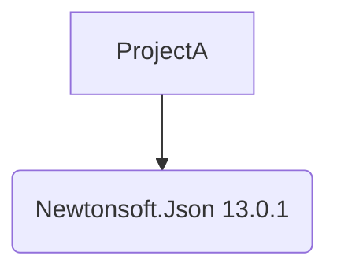

# Quickstart: NuGet Package Reference Rendering in `visualize`

## Prerequisites

- .NET 10 installed.
- ProjGraph CLI installed or built from source.

## Usage Guide

### Using the CLI

To visualize a solution with NuGet packages in Mermaid format:

```bash
projgraph visualize ./MySolution.sln --format mermaid --include-packages
```

To see dependencies in a tree structure:

```bash
projgraph visualize ./MyProject.csproj --format tree --include-packages
```

### Using MCP (within Cursor/VS Code)

Trigger the tool by asking:

- "Show me the project graph for [path] and include NuGet packages."
- "What NuGet packages does [path] depend on? Show me a diagram."

### Output Examples

#### Mermaid (Mermaid JS)



#### Tree View

```text
Dependency Graph: MyProject
Projects
[bold blue]MyProject[/]

🚀 [green]MyProject[/]
   └── [pkg] Newtonsoft.Json 13.0.1
```

#### Flat View

```text
Dependency Graph: MyProject
Projects
🚀 [green]MyProject[/]
   └── → [pkg] Newtonsoft.Json 13.0.1
```

## Troubleshooting

- **No packages shown**: Ensure you passed the `--include-packages` flag.
- **Transitive issues**: Note that this version only shows *direct* `PackageReference` items in project files.
- **Empty Output**: If the project doesn't have `<PackageReference>` items, the graph will only show projects (as before).
