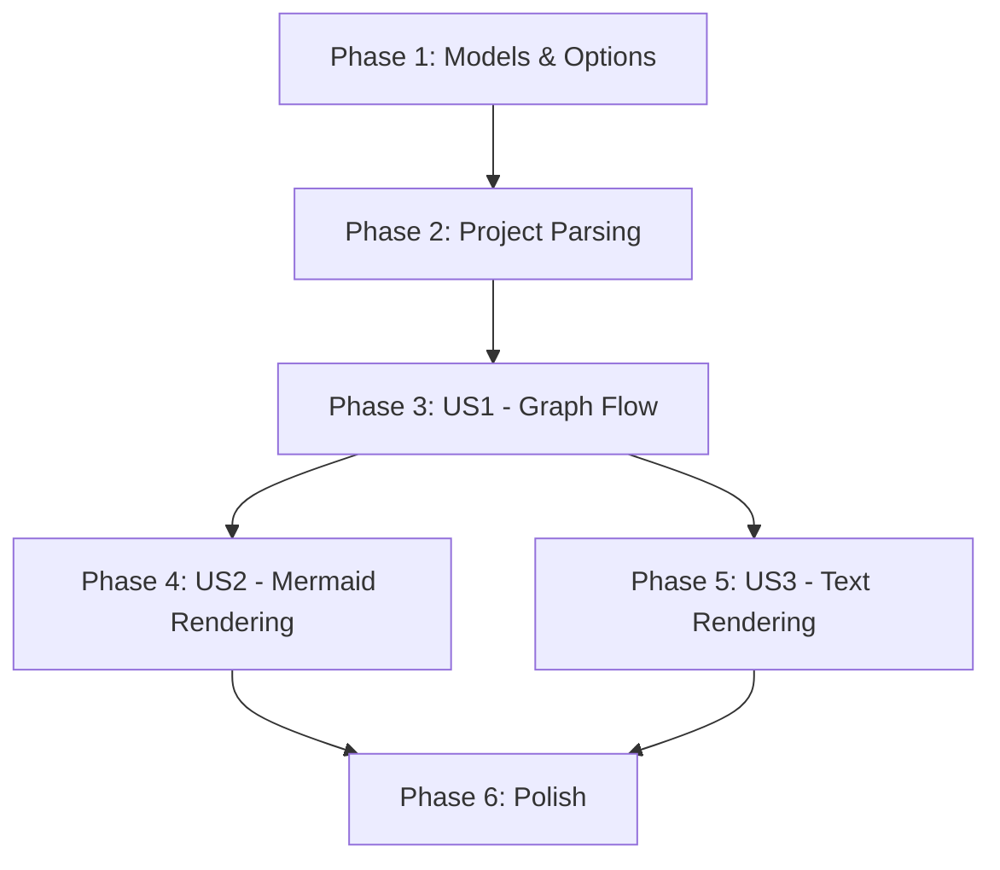

# Tasks: NuGet Package Reference Rendering in `visualize`

**Input**: Design documents from `/specs/008-nuget-package-rendering/`
**Prerequisites**: plan.md, spec.md, research.md, data-model.md, contracts/

## Summary of Implementation Strategy

We will update the project analysis pipeline to extract NuGet `PackageReference` items from `.csproj` files. This data will be modeled as `Project` nodes with a new `ProjectType.Package` type. The graph building logic will be updated to optionally include these nodes based on an `includePackages` flag. Finally, all three renderers (Mermaid, Tree, Flat) will be enhanced to display these package nodes with distinct visual markers (rounded nodes for Mermaid, `[pkg]` prefix for text).

## Format: `- [ ] [ID] [P?] [Story] Description with file path`

- **[P]**: Parallelizable task (independent files/logic)
- **[Story]**: Story ID (US1, US2, US3)

---

## Phase 1: Setup (Shared Infrastructure)

**Purpose**: Update core models and abstractions.

- [x] T001 [P] Add `Package = 4` to `ProjectType` enum in `src/ProjGraph.Core/Models/Project.cs`
- [x] T002 [P] Create `PackageReference` record in `src/ProjGraph.Core/Models/Dependency.cs`
- [x] T003 [P] Update `IProjectParser` to include `IEnumerable<PackageReference>` in `src/ProjGraph.Lib.Core/Abstractions/IProjectParser.cs`
- [x] T004 [P] Update `DiagramOptions` record to include `bool IncludePackages = false` in `src/ProjGraph.Lib.Core/Abstractions/DiagramOptions.cs`

---

## Phase 2: Foundational (Library Parsing & Core Logic)

**Purpose**: Implement the data extraction and graph building service updates.

- [x] T011 [P] Implement `PackageReference` extraction in `ProjectParser.Parse` in `src/ProjGraph.Lib.Core/Parsers/ProjectParser.cs`
- [x] T012 [P] Unit Test: Verify `ProjectParser` correctly extracts packages in `tests/ProjGraph.Tests.Unit.Core/Parsers/ProjectParserTests.cs`
- [x] T013 Update `IGraphService.BuildGraph` and `BuildGraphUseCase.Execute` signature to include `bool includePackages = false` in `src/ProjGraph.Lib.ProjectGraph/Application/IGraphService.cs` and `src/ProjGraph.Lib.ProjectGraph/Application/UseCases/BuildGraphUseCase.cs`
- [x] T014 Update `GraphService` implementation to pass the flag in `src/ProjGraph.Lib.ProjectGraph/Application/GraphService.cs`

---

## Phase 3: User Story 1 - View Project and Package Dependencies (Priority: P1) 🎯 MVP

**Goal**: Full flow from CLI/MCP to populated graph model with packages.

**Independent Test**: Build and run the CLI for a project with NuGet packages, verify that internal graph contains package nodes when debugging or via simple output.

### Implementation for User Story 1

- [x] T021 [US1] Update `BuildGraphUseCase.Execute` to inject "Package Node" (Project records) and create `PackageReference` dependencies in `src/ProjGraph.Lib.ProjectGraph/Application/UseCases/BuildGraphUseCase.cs`. Packages MUST be deduplicated in the `SolutionGraph.Projects` list.
- [x] T022 [P] [US1] Unit Test: Verify `BuildGraphUseCase` includes deduplicated packages and references in `tests/ProjGraph.Tests.Unit.ProjectGraph/BuildGraphUseCaseTests.cs`
- [x] T023 [US1] Add `--include-packages` flag to `VisualizeCommand.Settings` in `src/ProjGraph.Cli/Commands/VisualizeCommand.cs`
- [x] T024 [US1] Pass the flag from `VisualizeCommand.ExecuteAsync` to `graphService.BuildGraph` in `src/ProjGraph.Cli/Commands/VisualizeCommand.cs`
- [x] T025 [US1] Update `ProjGraphTools.get_project_graph` to include `includePackages` parameter in `src/ProjGraph.Mcp/Program.cs`
- [x] T026 [P] [US1] Integration Test: Verify CLI recognizes the flag in `tests/ProjGraph.Tests.Integration.Cli/VisualizeCommandTests.cs`
- [x] T027 [P] [US1] Integration Test: Verify MCP tool schema and parameters in `tests/ProjGraph.Tests.Integration.Mcp/McpProjectGraphTests.cs`

**Checkpoint**: Core logic and flag propagation are complete. Graph populated with packages.

---

## Phase 4: User Story 2 - Distinct Visualization in Diagrams (Priority: P2)

**Goal**: Update Mermaid renderer for rounded-corner package nodes.

**Independent Test**: Generate Mermaid output for a project with packages and confirm `id(label)` syntax is present for packages and `id[label]` for projects.

### Implementation for User Story 2

- [x] T031 [US2] Update `MermaidGraphRenderer.Render` to use `()` rounded syntax for nodes with `ProjectType.Package` in `src/ProjGraph.Lib.ProjectGraph/Rendering/MermaidGraphRenderer.cs`
- [x] T032 [P] [US2] Unit Test: Verify Mermaid renderer uses rounded nodes for packages in `tests/ProjGraph.Tests.Unit.ProjectGraph/MermaidGraphRendererTests.cs`

---

## Phase 5: User Story 3 - Distinct Labeling in Text Formats (Priority: P2)

**Goal**: Update Tree and Flat renderers to use `[pkg]` prefix.

**Independent Test**: Run `visualize --format tree --include-packages` and confirm `[pkg]` prefix appears before NuGet package names.

### Implementation for User Story 3

- [x] T041 [US3] Update `TreeGraphRenderer` to prepend `[pkg]` to package nodes in `src/ProjGraph.Lib.ProjectGraph/Rendering/TreeGraphRenderer.cs`
- [x] T042 [US3] Update `FlatGraphRenderer` to prepend `[pkg]` to package dependencies in `src/ProjGraph.Lib.ProjectGraph/Rendering/FlatGraphRenderer.cs`
- [x] T043 [P] [US3] Unit Test: Verify Tree renderer markup in `tests/ProjGraph.Tests.Unit.ProjectGraph/TreeGraphRendererTests.cs`
- [x] T044 [P] [US3] Unit Test: Verify Flat renderer markup in `tests/ProjGraph.Tests.Unit.ProjectGraph/FlatGraphRendererTests.cs`

---

## Phase 6: Polish & Cross-Cutting

- [x] T051 [P] Ensure all new/modified public APIs (IGraphService, BuildGraphUseCase, IProjectParser) have full XML documentation for DocFX and LLM tool context.
- [x] T052 [P] Verify performance impact for large solutions when flag is disabled (Success Criterion: <5% variance in execution time).
- [x] T053 [P] Final integration test with complex solution (e.g., ProjGraph.slnx itself) to verify deduplication.

## Dependency Graph

## Parallel Execution Opportunities

- Phase 1 tasks (T001-T004) can all run in parallel.
- Parser updates (T011) and Unit Tests (T012) can be worked on concurrently with signatures (T013).
- Visualization updates (Phase 4 and Phase 5) are independent and can run in parallel after Phase 3 is baseline stable.
- All test tasks marked with [P] can run in parallel with their corresponding implementation after the interface is defined.
