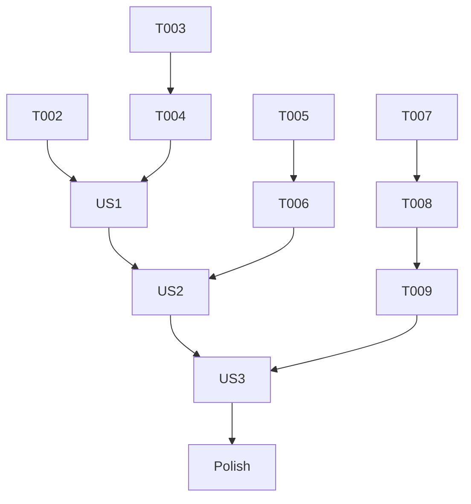

# Tasks: MCP Registry Submission

**Input**: Design documents from `/specs/011-mcp-registry-submission/`
**Prerequisites**: plan.md (required), spec.md (required for user stories), research.md, data-model.md, contracts/

**Organization**: Tasks are grouped by user story to enable independent implementation and testing of each story.

## Format: `[ID] [P?] [Story] Description`

- **[P]**: Can run in parallel (different files, no dependencies)
- **[Story]**: Which user story this task belongs to (e.g., US1, US2, US3)
- Include exact file paths in descriptions

## Phase 1: Setup (Shared Infrastructure)

**Purpose**: Project initialization and basic structure

- [X] T001 Document `MCP_REGISTRY_TOKEN` secret requirement in `specs/011-mcp-registry-submission/quickstart.md`

---

## Phase 2: Foundational (Blocking Prerequisites)

**Purpose**: Core infrastructure and configuration validation

- [X] T002 Verify `src/ProjGraph.Mcp/.mcp/server.json` schema compliance with MCP Registry requirements
- [X] T002b [US1] Validate that the identifier in `server.json` exactly matches the `mcp-name` tag in `src/ProjGraph.Mcp/README.md`

**Checkpoint**: Foundation ready - configuration validated

---

## Phase 3: User Story 1 - Ownership Verification (Priority: P1) 🎯 MVP

**Goal**: Include a standard ownership verification marker in the package README.

**Independent Test**: Verify the presence of `<!-- mcp-name: io.github.handys11/projgraph -->` at the end of `src/ProjGraph.Mcp/README.md`.

### Implementation for User Story 1

- [X] T003 [P] [US1] Add ownership verification comment to `src/ProjGraph.Mcp/README.md`
- [X] T004 [US1] Verify README comment presence in a local dry-run NuGet pack (`dotnet pack` then inspection)

**Checkpoint**: User Story 1 complete - README contains required verification tag

---

## Phase 4: User Story 2 - Registry Submission (Priority: P1)

**Goal**: Enable explicit server definition submission using the official publishing tool.

**Independent Test**: Successfully run `npx mcp-publisher publish` command manually (dry-run or preview if supported).

### Implementation for User Story 2

- [X] T005 [US2] Create local test script or documentation to run `npx mcp-publisher publish` for manual testing
- [X] T006 [US2] Verify `mcp-publisher` can successfully parse the `src/ProjGraph.Mcp/.mcp/server.json` file locally

**Checkpoint**: User Story 2 complete - Publishing tool integrated and verified locally

---

## Phase 5: User Story 3 - Release Process Integration (Priority: P1)

**Goal**: Automate registry submission as a standard part of every release.

**Independent Test**: Trigger a release and verify the "Publish to MCP Registry" step succeeds in GitHub Actions.

### Implementation for User Story 3

- [X] T007 [US3] Add "Publish to MCP Registry" step to `.github/workflows/publish.yml` using `npx mcp-publisher`
- [X] T008 [US3] Integrate `nick-fields/retry@v3` for the publish step in `.github/workflows/publish.yml` to handle transient network errors
- [X] T009 [US3] Configure step dependencies in `.github/workflows/publish.yml` to ensure publishing occurs after successful NuGet push

**Checkpoint**: User Story 3 complete - Registry submission is fully automated in the release pipeline

---

## Phase 6: Polish & Cross-Cutting Concerns

- [X] T010 Final validation of troubleshooting section in `specs/011-mcp-registry-submission/quickstart.md`
- [X] T011 Update `ARCHITECTURE.md` to include MCP Registry submission in the release flow description

## Dependency Graph

## Parallel Execution Examples

### Parallel Track: Metadata Preparation

- T003 [P] [US1] Add comment to README

## Implementation Strategy

1. **MVP (Phase 3)**: Focus on the README verification tag first as it's the blocking prerequisite for any registry ingestion.
2. **Incremental Delivery**: Enable manual publishing capability (Phase 4) before full automation (Phase 5). This allows for smoke testing the registry API without waiting for a full release cycle.
3. **Automation**: Integrate into GitHub Actions as the final step.
