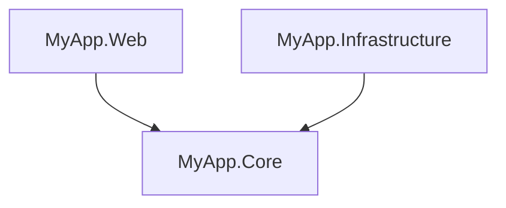
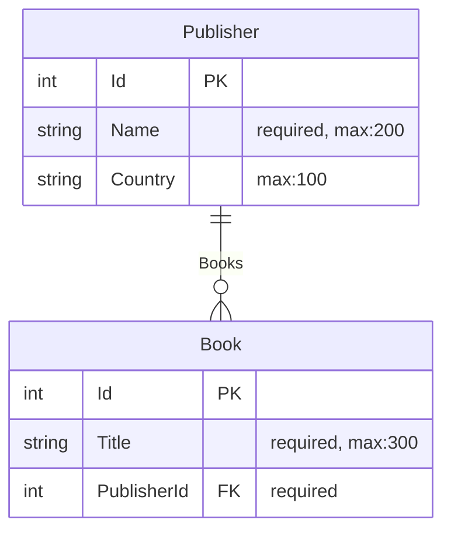

# ProjGraph CLI

Command-line tool for visualizing .NET project dependencies, generating Entity Relationship Diagrams, visualizing
class hierarchies, and computing key solution metrics.

[](https://www.nuget.org/packages/ProjGraph.Cli)
[](https://opensource.org/licenses/MIT)

## Installation

```bash
dotnet tool install -g ProjGraph.Cli
```

## Commands

### `visualize` - Project Dependencies

Visualize solution/project dependencies as ASCII tree or Mermaid diagram.

```bash
# ASCII tree (default)
projgraph visualize ./MySolution.sln

# Mermaid diagram (redirecting stdout)
projgraph visualize ./MySolution.slnx --format mermaid > graph.mmd

# Mermaid diagram (using output flag)
projgraph visualize ./MySolution.slnx --format mermaid --output graph.mmd

# Save as fenced Markdown
projgraph visualize ./MySolution.slnx --format mermaid --output docs/diagram.md

# Mermaid diagram without title header
projgraph visualize ./MySolution.slnx --format mermaid --show-title false
```

**Settings**:

- `[path]`: Path to `.sln`, `.slnx`, or `.csproj` file.
- `-f|--format`: Output format (`flat`, `tree`, `mermaid`). Default: `mermaid`.
- `-o|--output <file>`: Write diagram directly to file. Auto-creates directories.
- `--show-title <true|false>`: Include diagram title. Default: `true`.

**Supports**: `.sln`, `.slnx`, `.csproj`

**Example output**:



### `erd` - Entity Relationship Diagrams

Generate Mermaid ERD from EF Core `DbContext` or `ModelSnapshot` files.

```bash
# Generate ERD from DbContext
projgraph erd ./Data/MyDbContext.cs

# Generate ERD from ModelSnapshot (useful if migrations already exist)
projgraph erd ./Migrations/MyDbContextModelSnapshot.cs

# Save to file (stdout)
projgraph erd ./Data/MyDbContext.cs > database-schema.md

# Save to file (flag)
projgraph erd ./Data/MyDbContext.cs --output ./docs/database-schema.md

# Generate without title header
projgraph erd ./Data/MyDbContext.cs --show-title false
```

**Settings**:

- `[path]`: Optional path to `.cs` file. Searches current directory if not specified.
- `-c|--context <NAME>`: Optional context/snapshot name.
- `-o|--output <file>`: Write diagram directly to file. Auto-creates directories.
- `--show-title <true|false>`: Include diagram title. Default: `true`.

**Features**:

- Detects entities, properties, and relationships from source or snapshots
- Shows primary keys, foreign keys, and constraints
- Supports inheritance and base classes
- Extracts `MaxLength`, `Required`, and other data annotations
- Detects Fluent API configurations
- Handles many-to-many relationships with join tables

**Example output**:



### `classdiagram` - Class Hierarchies

Generate Mermaid Class Diagram for a specific class or an **entire directory** and its hierarchy.

```bash
# Generate class diagram for a specific file
projgraph classdiagram ./Models/Person.cs

# Include base classes/interfaces and dependencies
projgraph classdiagram ./Models/Person.cs --inheritance --dependencies

# Limit discovery depth
projgraph classdiagram ./Models/Person.cs --depth 2

# Hide properties and functions
projgraph classdiagram ./Models/Person.cs --properties false --functions false

# Save to file (stdout)
projgraph classdiagram ./Models/Person.cs > person-hierarchy.md

# Save to file (flag)
projgraph classdiagram ./Models/Person.cs --output docs/person.mmd
```

**Settings**:

- `[path]`: Required path to the `.cs` file or directory to analyze.
- `-i|--inheritance`: Search workspace for base classes and interfaces. Default: `false`.
- `-d|--dependencies`: Search and include other classes used as properties/fields. Default: `false`.
- `-o|--output <file>`: Write diagram directly to file. Auto-creates directories.
- `--properties <true|false>`: Display properties and fields in diagram. Default: `true`.
- `--functions <true|false>`: Display functions/methods in diagram. Default: `true`.
- `--depth <INTEGER>`: How many levels of relationships to follow. Default: `1`.
- `--show-title <true|false>`: Include diagram title. Default: `true`.

**Features**:

- Detects properties, fields, and inheritance (`<|--`)
- Discovers dependencies via property types (`*--` or `--`)
- Simple heuristic workspace-wide discovery of missing types (scans for `.sln`, `.slnx`, or `.csproj`)
- Support for generic types (sanitized for Mermaid as `~T~`)

### `stats` - Solution Metrics

Compute and display key architectural metrics for a .NET solution or project.

```bash
# Display metrics for a solution
projgraph stats ./MySolution.sln

# Show top 10 most-referenced projects instead of the default 5
projgraph stats ./MySolution.slnx --top 10

# Analyse a single project
projgraph stats ./src/MyApp/MyApp.csproj
```

**Settings**:

- `[path]`: Required path to `.sln`, `.slnx`, or `.csproj` file.
- `--top <n>`: Number of most-referenced (hotspot) projects to show. Default: `5`.

**Supports**: `.sln`, `.slnx`, `.csproj`

**Example output**:

```sh
────────────── MySolution ──────────────
 Total projects                      12
   Libraries                          7
   Executables                        2
   Test projects                      3
   Other                              0
 Average depth                      2.5
 Min depth                            1
 Max depth                            4
 Cycles detected                     No
 Analysis time                     42 ms

 Most-referenced projects:
   1. MyApp.Core                   ← 8
   2. MyApp.Shared                 ← 5
   3. MyApp.Infrastructure         ← 4
```

## Troubleshooting

- **No output**: Ensure the provided path exists and is a valid C# file.
- **Missing dependencies**: For `visualize`, ensure project references are present in the `.sln` or `.slnx` file.
- **Empty ERD**: For `erd`, ensure your `DbContext` class is public and uses Entity Framework Core naming conventions (
  ends with `DbContext`).
- **Parsing errors**: If using new C# features (e.g., primary constructors), ensure you have the latest .NET SDK
  installed.
- **Zero projects in `stats`**: Ensure the solution file is not empty and that all referenced `.csproj` files exist on
  disk.

## License

Licensed under the terms specified in the [repository](https://github.com/HandyS11/ProjGraph).
