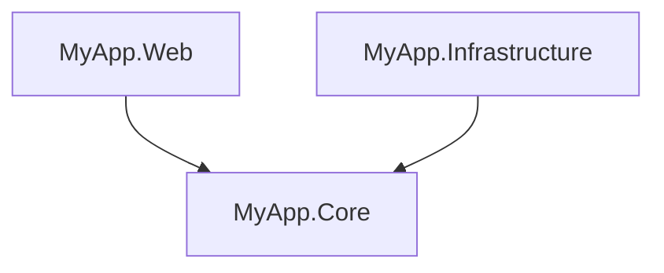
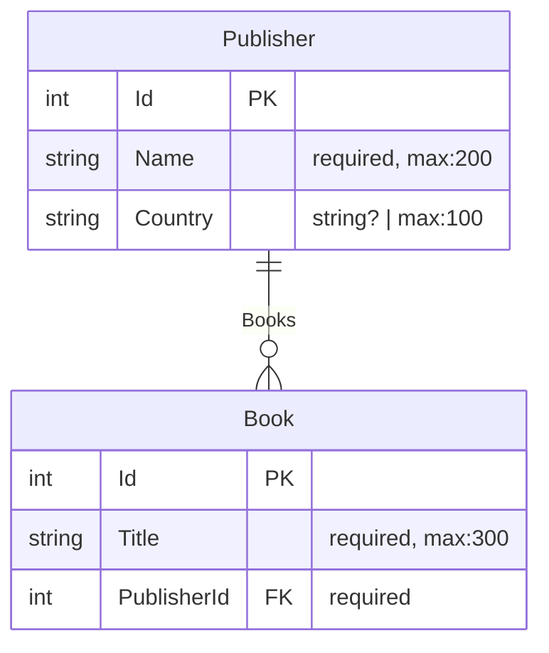
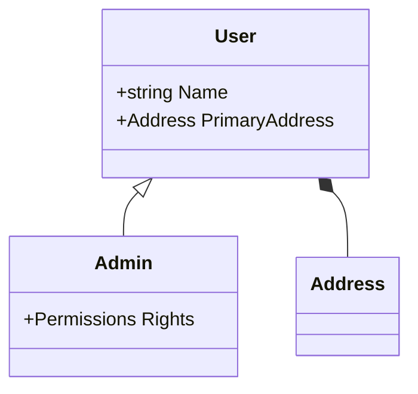

# ProjGraph CLI

Command-line tool for visualizing .NET project dependencies, generating Entity Relationship Diagrams, and visualizing
class hierarchies.

## Installation

```bash
dotnet tool install -g ProjGraph.Cli
```

## Commands

### `visualize` - Project Dependencies

Visualize solution/project dependencies as ASCII tree or Mermaid diagram.

```bash
# ASCII tree (default)
projgraph visualize ./MySolution.sln

# Mermaid diagram
projgraph visualize ./MySolution.slnx --format mermaid > graph.mmd
```

**Supports**: `.sln`, `.slnx`, `.csproj`

**Example output**:



### `erd` - Entity Relationship Diagrams

Generate Mermaid ERD from EF Core `DbContext` or `ModelSnapshot` files.

```bash
# Generate ERD from DbContext
projgraph erd ./Data/MyDbContext.cs

# Generate ERD from ModelSnapshot (useful if migrations already exist)
projgraph erd ./Migrations/MyDbContextModelSnapshot.cs

# Save to file
projgraph erd ./Data/MyDbContext.cs > database-schema.md
```

**Features**:

- Detects entities, properties, and relationships from source or snapshots
- Shows primary keys, foreign keys, and constraints
- Supports inheritance and base classes
- Extracts `MaxLength`, `Required`, and other data annotations
- Detects Fluent API configurations
- Handles many-to-many relationships with join tables

**Example output**:



### `classdiagram` - Class Hierarchies

Generate Mermaid Class Diagram for a specific class and its hierarchy.

```bash
# Analyze a specific class and discover its base types and dependencies
projgraph classdiagram ./Models/Admin.cs

# Specify depth of discovery (default: 3)
projgraph classdiagram ./Models/Admin.cs --depth 5
```

**Features**:

- Detects properties, fields, and inheritance (`<|--`)
- Discovers dependencies via property types (`*--` or `--`)
- Simple heuristic workspace-wide discovery of missing types (scans for `.sln`, `.slnx`, or `.csproj`)
- Support for generic types (sanitized for Mermaid as `~T~`)

**Example output**:



## Requirements

- .NET 10.0 or later

## License

Licensed under the terms specified in the [repository](https://github.com/HandyS11/ProjGraph).
