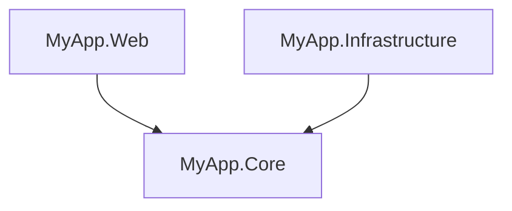
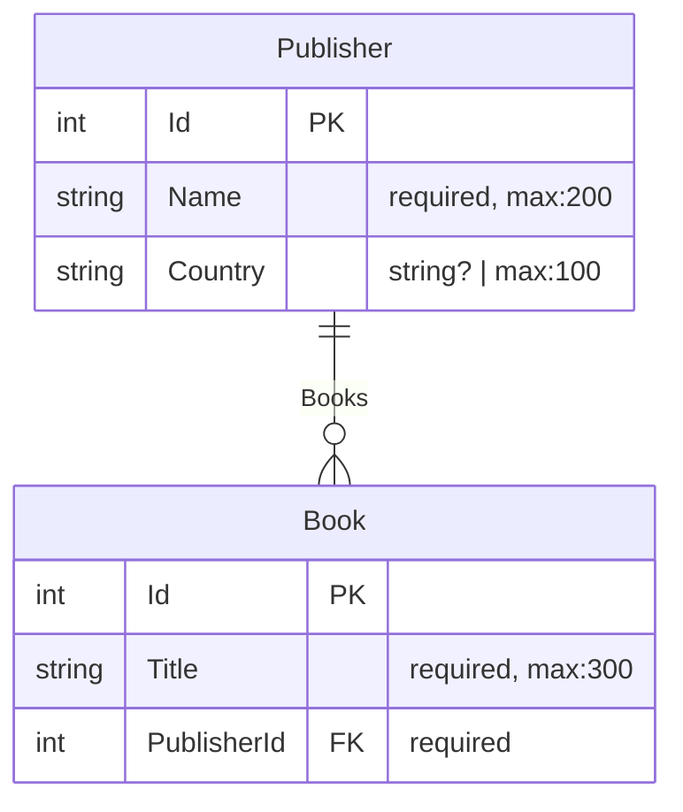

# ProjGraph CLI

Command-line tool for visualizing .NET project dependencies and generating Entity Relationship Diagrams from EF Core
DbContext files.

## Installation

```bash
dotnet tool install -g ProjGraph.Cli
```

## Commands

### `visualize` - Project Dependencies

Visualize solution/project dependencies as ASCII tree or Mermaid diagram.

```bash
# ASCII tree (default)
projgraph visualize ./MySolution.sln

# Mermaid diagram
projgraph visualize ./MySolution.slnx --format mermaid > graph.mmd
```

**Supports**: `.sln`, `.slnx`, `.csproj`

**Example output**:



### `erd` - Entity Relationship Diagrams

Generate Mermaid ERD from EF Core DbContext files.

```bash
# Generate ERD from DbContext
projgraph erd ./Data/MyDbContext.cs

# Save to file
projgraph erd ./Data/MyDbContext.cs > database-schema.md
```

**Features**:

- Detects entities, properties, and relationships
- Shows primary keys, foreign keys, and constraints
- Supports inheritance and base classes
- Extracts `MaxLength`, `Required`, and other data annotations
- Detects Fluent API configurations
- Handles many-to-many relationships with join tables

**Example output**:



## Requirements

- .NET 10.0 or later

## License

Licensed under the terms specified in the [repository](https://github.com/HandyS11/ProjGraph).
