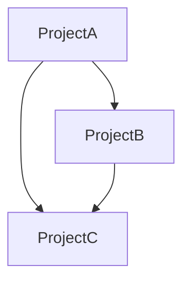
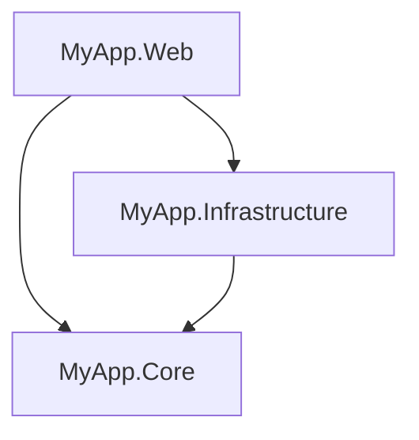

# ProjGraph CLI

**ProjGraph.Cli** is a command-line tool for visualizing .NET project dependencies. It parses `.sln`, `.slnx`, and
`.csproj` files to generate clear, readable dependency graphs in your terminal or export them to various formats.

## Features

- **ASCII Tree Visualization**: Beautiful tree-style output with colored formatting
- **Mermaid.js Export**: Generate Mermaid diagrams for documentation
- **Modern .NET Support**: Full support for `.slnx` (modern solution format) alongside traditional `.sln` files
- **Circular Dependency Detection**: Automatically identifies and highlights dependency cycles
- **Fast & Lightweight**: Built with performance in mind

## Requirements

- .NET 10.0 or later runtime
- Supported platforms: Windows, macOS, Linux

## Installation

Install the CLI tool globally:

```bash
dotnet tool install -g ProjGraph.Cli
```

Update to the latest version:

```bash
dotnet tool update -g ProjGraph.Cli
```

## Usage

### Basic Visualization

Visualize a solution or project as an ASCII tree:

```bash
projgraph visualize ./MySolution.sln
```

```bash
projgraph visualize ./MySolution.slnx
```

```bash
projgraph visualize ./MyProject.csproj
```

### Export to Mermaid

Generate a Mermaid.js diagram for documentation:

```bash
projgraph visualize ./MySolution.slnx --format mermaid
```

You can redirect the output to a file:

```bash
projgraph visualize ./MySolution.slnx --format mermaid > dependency-graph.mmd
```

Then include it in your Markdown documentation:

````markdown

````

## Command Reference

### `visualize`

Analyzes and visualizes project dependencies.

**Syntax:**

```bash
projgraph visualize <PATH> [OPTIONS]
```

**Arguments:**

- `<PATH>`: Path to the `.sln`, `.slnx`, or `.csproj` file

**Options:**

- `-f, --format <FORMAT>`: Output format (default: `tree`)
  - `tree`: ASCII tree visualization with colors
  - `mermaid`: Mermaid.js diagram format

**Examples:**

```bash
# Visualize as tree (default)
projgraph visualize ./MySolution.sln

# Export as Mermaid
projgraph visualize ./MySolution.slnx -f mermaid

# Short option syntax
projgraph visualize ./MyProject.csproj --format mermaid
```

## Output Examples

### Tree Format

```x
📦 MySolution
├── 🔷 MyApp.Web
│   ├── → MyApp.Core
│   └── → MyApp.Infrastructure
├── 🔷 MyApp.Core
└── 🔷 MyApp.Infrastructure
    └── → MyApp.Core
```

### Mermaid Format



## Supported File Formats

- **`.sln`**: Traditional Visual Studio solution files
- **`.slnx`**: Modern XML-based solution files (Visual Studio 2022+)
- **`.csproj`**: C# project files (analyzes project references)

## Integration with MCP

For programmatic access via AI assistants, check out the [ProjGraph.Mcp](https://www.nuget.org/packages/ProjGraph.Mcp)
tool.

## License

Licensed under the terms specified in the [repository](https://github.com/HandyS11/ProjGraph).
