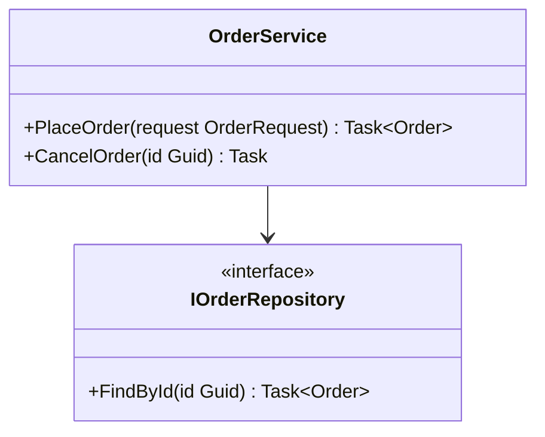

# ProjGraph.Lib.ClassDiagram

Roslyn-powered class hierarchy analysis and Mermaid class diagram generation for .NET projects.

[](https://www.nuget.org/packages/ProjGraph.Lib.ClassDiagram)
[](https://opensource.org/licenses/MIT)

## Installation

```bash
dotnet add package ProjGraph.Lib.ClassDiagram
```

## Overview

`ProjGraph.Lib.ClassDiagram` uses the Roslyn workspace API to analyze C# source code and generate
[Mermaid class diagrams](https://mermaid.js.org/syntax/classDiagram.html). It supports:

- Analyzing individual `.cs` files or entire project workspaces
- Extracting classes, records, interfaces, abstract types, enums, and structs
- Capturing fields, properties, methods, and their visibility modifiers
- Detecting inheritance, implementation, and composition relationships
- Configurable member visibility filters

## Usage

Register all services:

```csharp
using ProjGraph.Lib.Core;
using ProjGraph.Lib.ClassDiagram;

services.AddProjGraphCore();
services.AddProjGraphClassDiagram();
```

### Generate a class diagram from a project

```csharp
using ProjGraph.Lib.ClassDiagram.Application;
using ProjGraph.Lib.ClassDiagram.Application.UseCases;

var analysisService = provider.GetRequiredService<IClassAnalysisService>();

var result = await analysisService.AnalyzeAsync("src/MyProject/MyProject.csproj", new AnalysisOptions
{
    IncludePrivateMembers = false,
    IncludeInternalTypes = false
});

var renderer = provider.GetRequiredService<MermaidClassDiagramRenderer>();
string diagram = renderer.Render(result);
```

**Example output:**



### Analyze a single file or directory

```csharp
var analyzeFile = provider.GetRequiredService<AnalyzeFileUseCase>();
var result = await analyzeFile.ExecuteAsync("src/Domain/Order.cs");

var analyzeDirectory = provider.GetRequiredService<AnalyzeDirectoryUseCase>();
var result = await analyzeDirectory.ExecuteAsync("src/Domain/");
```

## Key Services

| Service                       | Description                                         |
|-------------------------------|-----------------------------------------------------|
| `IClassAnalysisService`       | Orchestrates full Roslyn workspace analysis         |
| `AnalyzeFileUseCase`          | Analyzes a single C# source file                    |
| `AnalyzeDirectoryUseCase`     | Analyzes all `.cs` files in a directory             |
| `MermaidClassDiagramRenderer` | Renders analysis results as a Mermaid class diagram |

## Links

- [GitHub Repository](https://github.com/HandyS11/ProjGraph)
- [Documentation](https://handys11.github.io/ProjGraph)
- [CLI tool](https://www.nuget.org/packages/ProjGraph.Cli) — `projgraph classdiagram`
