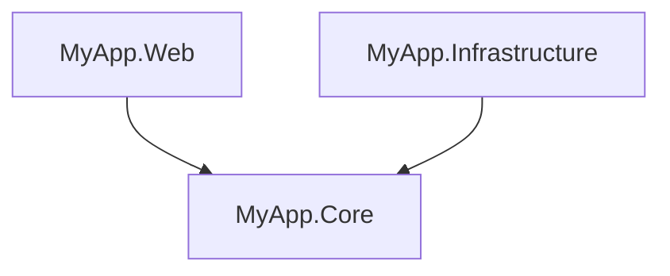

# ProjGraph.Lib.Dependencies

Project dependency graph analysis, solution statistics, and ASCII/Mermaid rendering for .NET solutions.

[](https://www.nuget.org/packages/ProjGraph.Lib.Dependencies)
[](https://opensource.org/licenses/MIT)

## Installation

```bash
dotnet add package ProjGraph.Lib.Dependencies
```

## Overview

`ProjGraph.Lib.Dependencies` analyzes .NET solution and project files to build a dependency graph and compute
solution-level statistics. It renders the result as:

- **ASCII tree** — human-readable console output
- **Flat list** — simple project list
- **Mermaid diagram** — `graph TD` format for embedding in Markdown, wikis, or documentation sites

NuGet package references can optionally be included in the graph alongside project references.

## Usage

Register all services:

```csharp
using ProjGraph.Lib.Core;
using ProjGraph.Lib.Dependencies;

services.AddProjGraphCore();
services.AddProjGraphDependencies();
```

### Generate a Mermaid graph

```csharp
using ProjGraph.Core.Models;
using ProjGraph.Lib.Dependencies.Application;
using ProjGraph.Lib.Dependencies.Rendering;

var graphService = provider.GetRequiredService<IGraphService>();

var result = await graphService.BuildGraphAsync("MySolution.slnx", includePackages: false);
var renderer = provider.GetRequiredService<MermaidGraphRenderer>();
string diagram = renderer.Render(result);
```

**Example output:**



### Compute solution statistics

```csharp
var statsService = provider.GetRequiredService<IStatsService>();
var stats = await statsService.ComputeStatsAsync("MySolution.slnx");

Console.WriteLine($"Solution : {stats.SolutionName}");
Console.WriteLine($"Projects : {stats.TotalProjectCount}");
Console.WriteLine($"Max depth: {stats.DepthStats.Max}");
Console.WriteLine($"Cycles   : {stats.HasCycles}");

foreach (var hotspot in stats.HotspotProjects)
{
    Console.WriteLine($"  {hotspot.Name} ← {hotspot.InDegree} projects");
}
```

## Key Services

| Service                | Description                                                     |
|------------------------|-----------------------------------------------------------------|
| `IGraphService`        | Builds the full dependency graph for a solution or project file |
| `IStatsService`        | Computes aggregate metrics for a solution                       |
| `MermaidGraphRenderer` | Renders a graph as a Mermaid `graph TD` diagram                 |
| `TreeGraphRenderer`    | Renders a graph as an ASCII dependency tree                     |
| `FlatGraphRenderer`    | Renders a graph as a flat list                                  |

## Supported Input Formats

`.sln` · `.slnx` · `.csproj`

## Links

- [GitHub Repository](https://github.com/HandyS11/ProjGraph)
- [Documentation](https://handys11.github.io/ProjGraph)
- [CLI tool](https://www.nuget.org/packages/ProjGraph.Cli) — `projgraph visualize`
