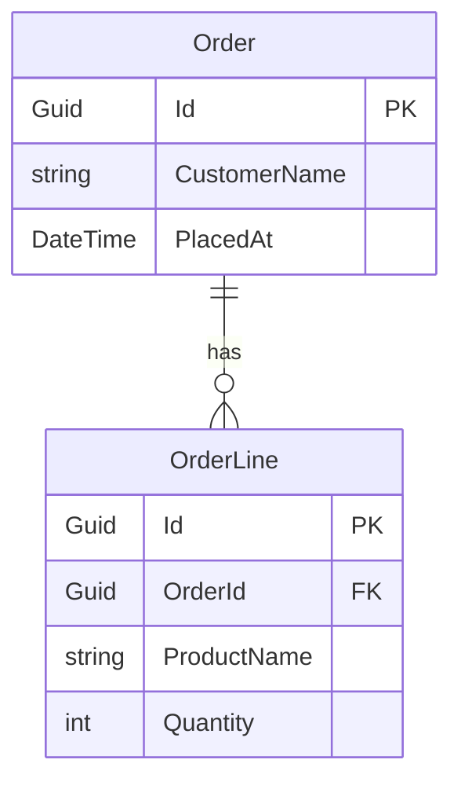

# ProjGraph.Lib.EntityFramework

Entity Framework Core DbContext and ModelSnapshot analysis with Mermaid ERD generation for .NET projects.

[](https://www.nuget.org/packages/ProjGraph.Lib.EntityFramework)
[](https://opensource.org/licenses/MIT)

## Installation

```bash
dotnet add package ProjGraph.Lib.EntityFramework
```

## Overview

`ProjGraph.Lib.EntityFramework` parses EF Core `DbContext` source files and compiled `ModelSnapshot` migration
snapshots to produce [Mermaid ERD diagrams](https://mermaid.js.org/syntax/entityRelationshipDiagram.html).

It supports:

- Discovering `DbContext` and `ModelSnapshot` files in a project directory
- Extracting entities/tables, columns/properties (with types and nullability), and foreign-key relationships
- Both Fluent API and data annotation configuration
- Generating Mermaid `erDiagram` diagrams

## Usage

Register all services:

```csharp
using ProjGraph.Lib.Core;
using ProjGraph.Lib.EntityFramework;

services.AddProjGraphCore();
services.AddProjGraphEntityFramework();
```

### Generate an ERD from a DbContext file

```csharp
using ProjGraph.Lib.EntityFramework.Application;
using ProjGraph.Lib.EntityFramework.Application.UseCases;

var efAnalysisService = provider.GetRequiredService<IEfAnalysisService>();

var model = await efAnalysisService.AnalyzeContextAsync("src/Data/AppDbContext.cs");

var renderer = provider.GetRequiredService<MermaidErdRenderer>();
string diagram = renderer.Render(model);
```

**Example output:**



### Generate an ERD from a ModelSnapshot

```csharp
var analyzeSnapshot = provider.GetRequiredService<AnalyzeSnapshotUseCase>();
var model = await analyzeSnapshot.ExecuteAsync("src/Migrations/AppDbContextModelSnapshot.cs");
```

### Discover contexts or snapshots automatically

```csharp
var discoverContexts = provider.GetRequiredService<DiscoverContextsUseCase>();
IReadOnlyList<string> contextFiles = await discoverContexts.ExecuteAsync("src/");

var discoverSnapshots = provider.GetRequiredService<DiscoverSnapshotsUseCase>();
IReadOnlyList<string> snapshotFiles = await discoverSnapshots.ExecuteAsync("src/");
```

## Key Services

| Service                    | Description                                    |
|----------------------------|------------------------------------------------|
| `IEfAnalysisService`       | Orchestrates full EF model analysis            |
| `AnalyzeContextUseCase`    | Analyzes a `DbContext` source file             |
| `AnalyzeSnapshotUseCase`   | Analyzes a compiled `ModelSnapshot`            |
| `DiscoverContextsUseCase`  | Finds all `DbContext` files in a directory     |
| `DiscoverSnapshotsUseCase` | Finds all `ModelSnapshot` files in a directory |
| `MermaidErdRenderer`       | Renders an `EfModel` as a Mermaid `erDiagram`  |

## Links

- [GitHub Repository](https://github.com/HandyS11/ProjGraph)
- [Documentation](https://handys11.github.io/ProjGraph)
- [CLI tool](https://www.nuget.org/packages/ProjGraph.Cli) — `projgraph erd`
